# Лабораторная работа № 6. Безусловный экстремум.

Выполнил студент группы 426, Иванов Александр Андреевич.

## Вариант № 03
Найти точку **минимума** функции 
>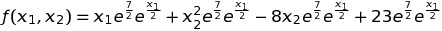

методом **Ньютона-Рафсона.** Для одномерной минимизации использовать метод **равномерного поиска.** Для поиска интервала унимодальности использовать алгоритм **Свенна.**


## Теоретическая часть

В методе **Ньютона-Рафсона** последовательность строится по формуле 
>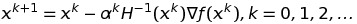

В качестве величины шага спуска 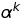 > 0 Выбирают решение задачи одномерной минимизации
>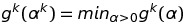

>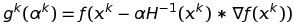

В методе **равномерном поиске** на интеревале [a,b] задается N+1 равномерно расположенных точек 
>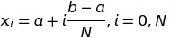 

в которых вычисляются значения минимизируемой функции. Ищется точка 

>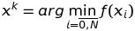 

и если длина интервала 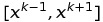 меньше заданого epsilon то за точку минимума может быть взята точка 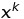, в противном случае интервал  дробится равномерно.

Для поиска интервала унимодальности используется алгоритм **Свенна.**

Метод Свенна организует начальную локализацию минимума унимодальной функции, т.е. простой одномерный поиск с удвоением шага, критерием окончания которого является появление признака возрастания функции.

## Практическая часть

###Структура программы

* Функции производных

    ```c++
    double function(const double &x1,const double &x2);

    double partial_f1_x1(const double  &x1,const double  &x2);

    double partial_f1_x2(const double &x1,const double &x2);

    double partial_f2_x1(const double &x1,const double &x2);

    double partial_f2_x2(const double &x1,const double &x2);

    double partial_f_x1_x2(const double  &x1,const double  &x2);
    ```
    
* Функции вычисления матрицы Гассе и обратной матрицы.

    ```c++
    double **matrix_gesse(const double  &x1,const double  &x2);
    
    double **inverse_matrix(double** const A, int N);
    ```
    Возвращают матрицы
    
* Функции Свенна для x1 и x2

    ```c++
    double *swanna_x1(const double &x1,const double &x2);
    
    double *swanna_x2(const double &x1,const double &x2);
    ```
    Возвращают значения точки
    
* Функция равномерного поиска 
    
    ```c++
    void method_uniform();
    ```
    
* Функция main здесь написан метод Ньютона.
    
* Вывод Программы 
    
    ```c++
    =======N-R======
    x1 = -8.99999 x2 = 4 
    Iteration: 9
    f(x1,x2) = -0.735759
    
    --Swanna--
    [-8.99999 : -9.00099]
    [4 : 3.999]
    
    ===Method uniform===
    x1 = -9  x2 = 4
    ```
    
    Метод Случайного поиска
    
    ```c++
    x1 = -9.00071  x1 = 4.00011 f = -0.735759

    ```
    
    Meтод Нелдура-Мида
    
    ```c++
    x1 = -9.03926
    x2 = 3.96535
    minF = -0.735186
    iterations = 20
    ```
    
* Запуск программы и компиляция
    
    ```
    Компиляция
    g++ lab6.cpp 
    g++ neidel-mid.cpp -o neidel
    g++ random_serach.cpp -o rs
    
    Запуск 
    ./a.out
    ./neidel
    ./rs
    ```


### Результаты
В результате работы программы у функции  был найден экстремум в точке (x1 = -9, x2 = 4) (начальная точка (x1 = 8, x2 = -7) были заменены на (x1 = -1, x2 = 5) так как начальные точки были выбраны не оптимально) за 9 итераций методами Ньютона-Рафсона с точностью 0.00001. 


>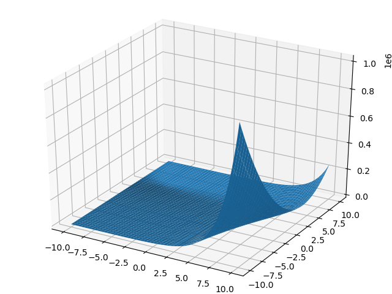

>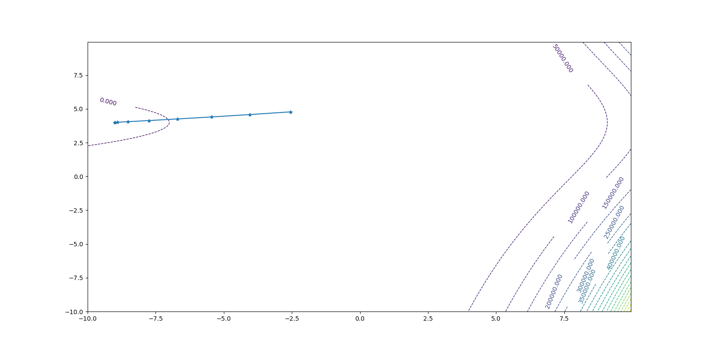

>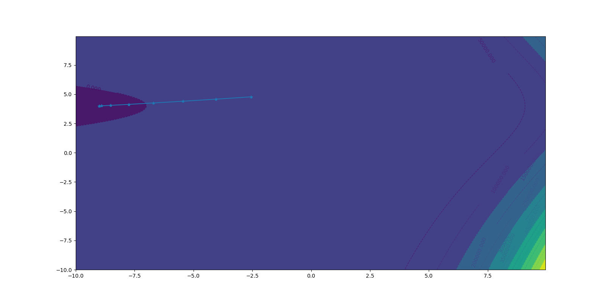


